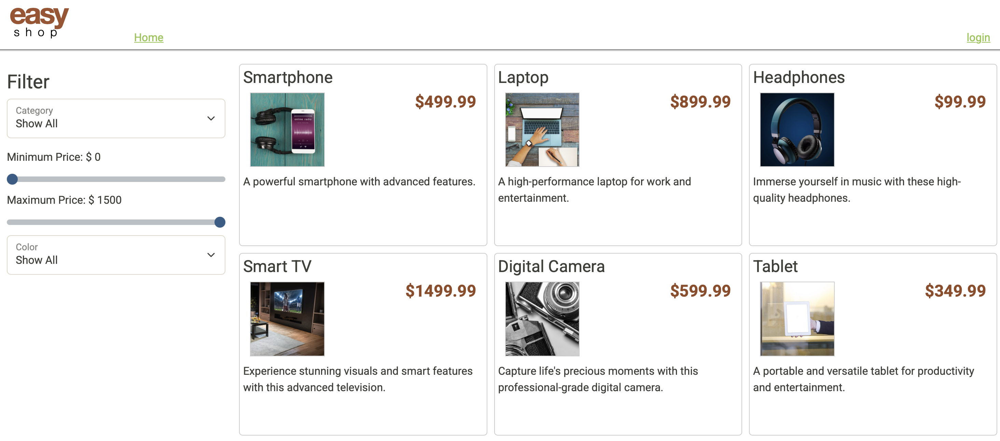
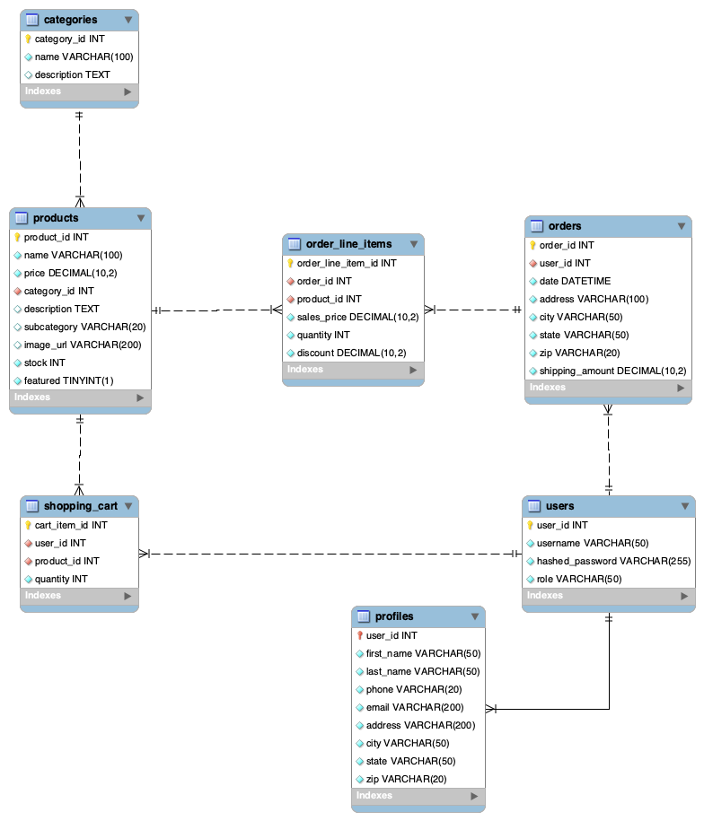
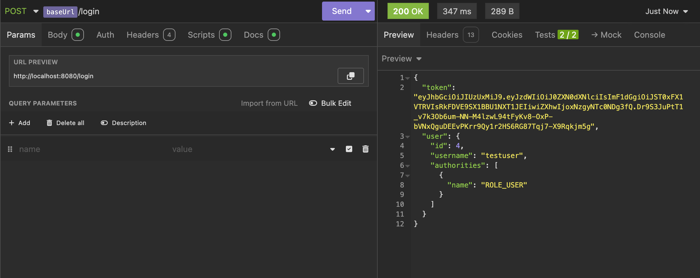
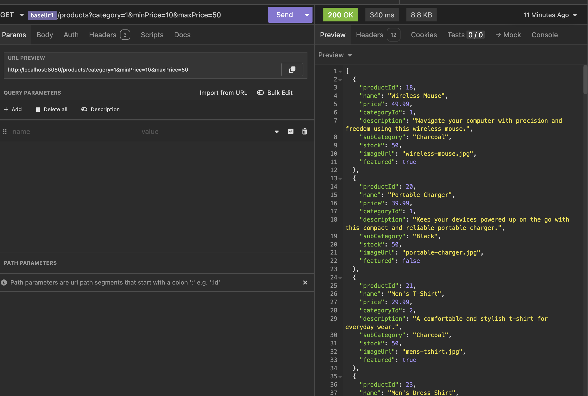
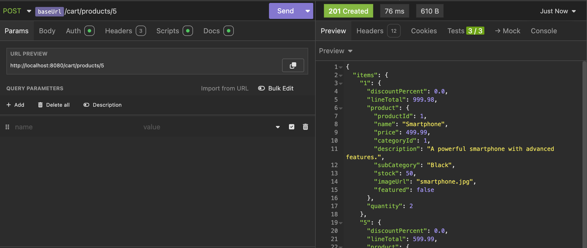
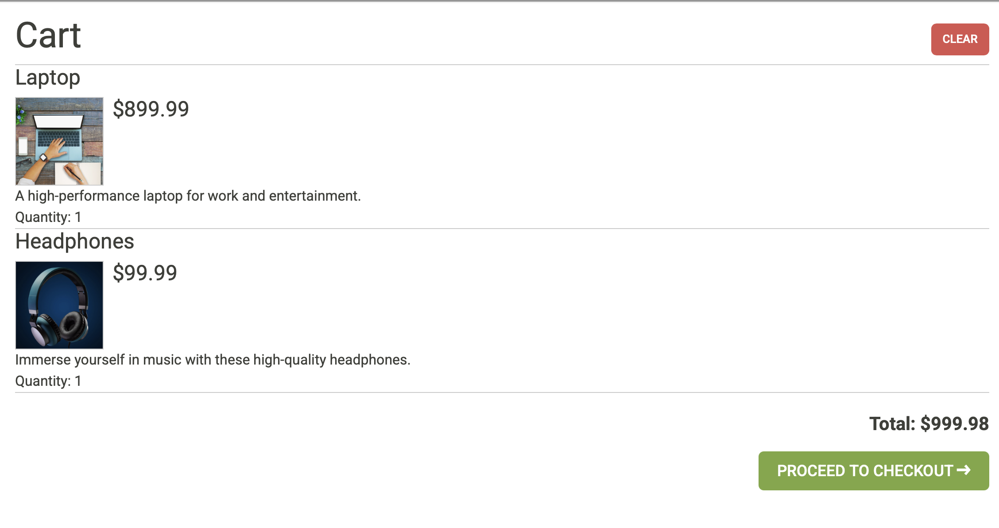
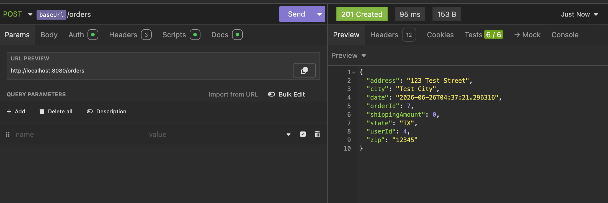

# EasyShop E-Commerence App 

<details>
  <summary> <h2> Table of Contents</h2> </summary>
    <ol>
      <li> Description </li>
      <li> Features </li>
      <li> Technolgies Used </li>
      <li> Database Structure </li>
      <li> How to Run </li>
      <li> Examples </li>
      <li> Author </li>
    </ol>
</details>



## Description 🔎
EasyShop is a full stack e-commerce application built with Java and Spring Boot. The application provides a RESTful API for 
managing products,categories, shopping carts, user profiles, and customer orders.
  
The project implements secure authentication using JWT tokens and follows a layered architecture consisting of controllers,
services, repositories, and domain models.

## Features 💎
- #### Product Management
  - Browse products
  - Search and filter products
  - View product details
  - Manage inventory stock levels
  - Featured product support
- #### Category Management
  - Organize products by category
  - Filter products by category and subcategory
- #### Shopping Cart
  - Add products to cart
  - Update product quantities
  - Remove products from cart
  - Calculate cart totals
  - Persist cart data in the database
- #### User Management
  - User registration
  - User login
  - JWT-based authentication
  - User profile management
- #### Order Processing
  - Create customer orders
  - Store order line items
  - Track shipping information
  - Maintain order history
- #### Security
  - Spring Security integration
  - JWT authentication
  - Role-based authorization
  - Protected API endpoints
 
## Technologies Used
- #### Backend
  - Java 17
  - Spring Boot
  - Spring Security
  - Spring Data JPA
  - Hibernate
- #### Database
  - MySQL
- #### API Documentation
  - Insomnia
- #### Build Tools
  - Maven

## Database Structure 


## How to Run 🏃

### Prerequisites

* Java 17+
* Maven
* MySQL

### Clone Repository

```bash
git clone https://github.com/yourusername/easyshop.git
cd easyshop
```

### Configure Database

Update your database credentials in:

```properties
src/main/resources/application.properties
```

Example:

```properties
spring.datasource.url=jdbc:mysql://localhost:3306/easyshop
spring.datasource.username=root
spring.datasource.password=password
```

### Run the Application

```bash
mvn spring-boot:run
```

The application will start on:

```text
http://localhost:8080
```

### Prerequisites

* Java 17+
* Maven
* MySQL

### Clone Repository

```bash
git clone https://github.com/yourusername/easyshop.git
cd easyshop
```

### Configure Database

Update your database credentials in:

```properties
src/main/resources/application.properties
```

Example:

```properties
spring.datasource.url=jdbc:mysql://localhost:3306/easyshop
spring.datasource.username=root
spring.datasource.password=password
```

### Run the Application

```bash
mvn spring-boot:run
```

The application will start on:

```text
http://localhost:8080
```

## Examples 👀

Users can authenticate by submitting valid credentials to the login endpoint. Upon successful authentication, the API generates and returns a JWT token, which is used to authorize access to protected resources throughout the application.


The product search endpoint supports dynamic filtering by category, price range, color, and additional product attributes. This functionality was implemented using Spring Data JPA and custom repository queries to provide flexible product discovery.  


The shopping cart interface displays products added by the user, including item quantities, pricing information, and calculated totals. Cart updates are persisted through backend API endpoints and reflected in real time within the user interface.  



The shopping cart endpoint retrieves all items associated with the authenticated user, including product details and quantities. Custom JPA queries were used to efficiently load cart items and related product information in a single request.  


The order endpoint processes customer purchases by converting shopping cart items into order records and associated line items. The implementation validates order information, stores purchase history, and maintains relationships between orders, products, and users.

## Author
#### Kevin Nguyen 
Email: knguyen@my.yearupunited.org  

